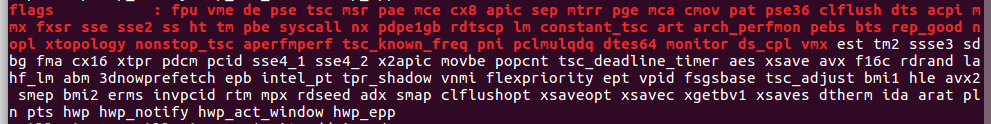

# Semana 2 ( A partir del 21 de septiembre de 2017)

### Introducción a la infraestructura virtual: concepto y soporte físico

#### Ejercicio 1. Consultar en el catálogo de alguna tienda de informática el precio de un ordenador tipo servidor y calcular su coste de amortización a cuatro y siete años. Consultar este [artículo](http://infoautonomos.eleconomista.es/consultas-a-la-comunidad/988/) en Infoautónomos sobre el tema. 

El servidor consultado es el [HP ProLiant ML30 Gen9 Intel Xeon E3-1220V5/8GB/2TB](https://www.pccomponentes.com/hp-proliant-ml30-gen9-intel-xeon-e3-1220v5-8gb-2tb) de la tienda online [Pccomponentes](https://www.pccomponentes.com/). El precio de este servidor asciende a 815,59€ (IVA incluido). Su precio sin IVA es 674,05€.

Consultando la [tabla de amortizaciones simplificada](http://www.agenciatributaria.es/AEAT.internet/Inicio/Ayuda/Manuales__Folletos_y_Videos/Manuales_practicos/_Ayuda_Folleto_Actividades_economicas/3__Impuesto_sobre_la_Renta_de_las_Personas_Fisicas/3_5_Estimacion_directa_simplificada/3_5_4__Tabla_de_amortizacion_simplificada/3_5_4__Tabla_de_amortizacion_simplificada.html) de la Agencia Tributaria del Gobierno de España, podemos comprobar que el coeficiente lineal máximo para equipos informáticos es del 26% con un período máximo de 10 años.

Esto quiere decir que si nuestro servidor vale 815,59€, ahora valdrá 603,54€ aproximadamente. De tal manera que al año siguiente se puede deducir a otros 212,05€. 

A los 4 años el servidor ya valdrá 0€... Ni que decir tiene que a los 7 años de amortización seguirá costando lo mismo que a los 4.

#### Ejercicio 2.Usando las tablas de precios de servicios de alojamiento en Internet “clásicos”, es decir, que ofrezcan Virtual Private Servers o servidores físicos, y de proveedores de servicios en la nube, comparar el coste durante un año de un ordenador con un procesador estándar (escogerlo de forma que sea el mismo tipo de procesador en los dos vendedores) y con el resto de las características similares (tamaño de disco duro equivalente a transferencia de disco duro) en el caso de que la infraestructura comprada se usa sólo el 1% o el 10% del tiempo.

**Servidor dedicado** (físico)

[Servidor Linux Intel® Xeon® E3-1230v3](https://www.strato.es/servidor-dedicado-linux/) con el proveedor [Strato](https://www.strato.es/)

**Servidor virtual**

[Servidor Linux o CentOS](https://azure.microsoft.com/es-es/pricing/details/virtual-machines/linux/). Instancia B4MS del proveedor [Microsoft Azure](https://azure.microsoft.com/es-es/). Similares características al servidor dedicado.

#### Ejercicio 3. En general, cualquier ordenador con menos de 5 o 6 años tendrá estos flags. ¿Qué modelo de procesador es? ¿Qué aparece como salida de esa orden? Si usas una máquina virtual, ¿qué resultado da? ¿Y en una Raspberry Pi o, si tienes acceso, [el procesador del móvil](https://stackoverflow.com/questions/26239956/how-to-get-specific-information-of-an-android-device-from-proc-cpuinfo-file)?

Procesador Intel® Core™ i7-6700HQ (6M Cache, 2.6GHz hasta 3.5GHz)

Una vez usado el comando aparece como salida 8 veces (una por cada hebra del procesador, 4 cores y 2 hebras por cada uno) los flags activos.

