#### Ejercicio 1.  Descargar y ejecutar las pruebas de alguno de los proyectos anteriores, y si sale todo bien, hacer un pull request a este proyecto con tests adicionales, si es que faltan (en el momento que se lea este tema).

En este caso he hecho fork al repositorio [tdd-gdg](https://github.com/guillesiesta/tdd-gdg) de JJ y he añadido un par de funciones más y unos tests que las testean.

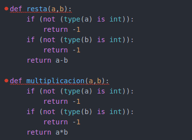

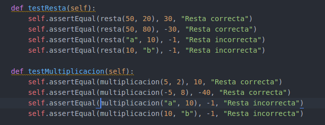

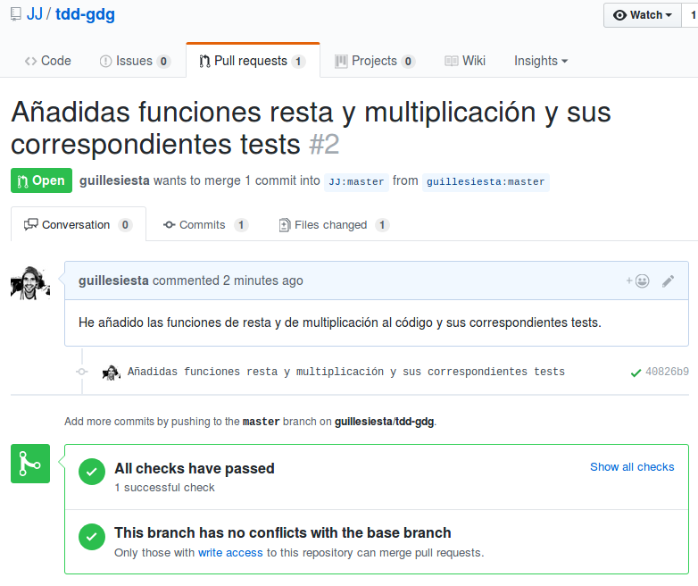

#### Ejercicio 2. Para la aplicación que se está haciendo, escribir una serie de aserciones y probar que efectivamente no fallan. Añadir tests para una nueva funcionalidad, probar que falla y escribir el código para que no lo haga (vamos, lo que viene siendo TDD).

Primero he añadido una función en la que se introduce el título de una historia y se ha testeado. 

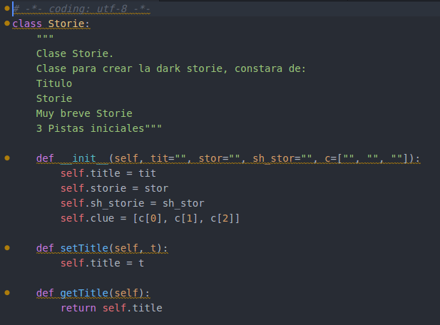

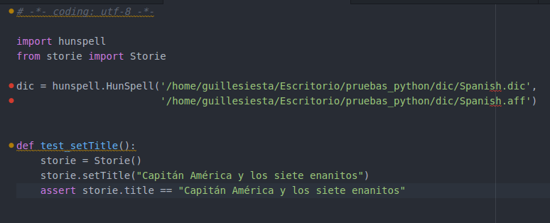

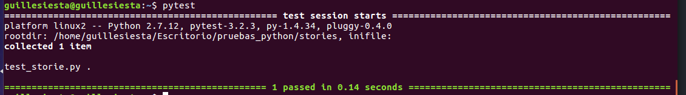

Después he añadido la funcionalidad de que ese texto no tiene faltas de ortografía. Para lo segundo, he usado un [diccionario de Hunspell con codificación UTF-8 en Español](https://github.com/titoBouzout/Dictionaries). 

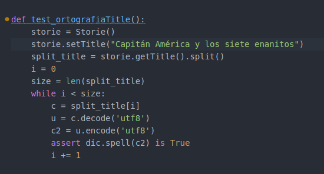

Pruebo el test con el título que le he puesto y me da error, pues "enanito" no está reconocida en la rae.

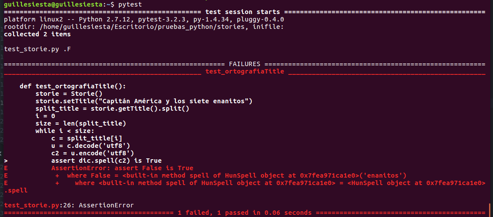

Corrijo el error. Sustituyo "enanitos" por "enanos", testeo y el test se pasa con éxito.

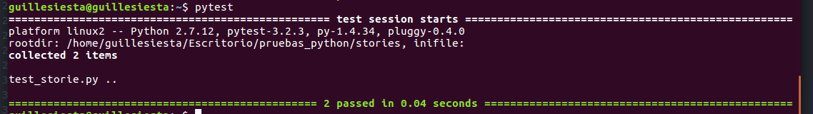

#### Ejercicio 3. Convertir los tests unitarios anteriores con assert a programas de test y ejecutarlos desde mocha, usando descripciones del test y del grupo de test de forma correcta. Si hasta ahora no has subido el código que has venido realizando a GitHub, es el momento de hacerlo, porque lo vas a necesitar un poco más adelante.

Como estoy usando python. Usaré [Behave](http://pythonhosted.org/behave/index.html), que es lo equivalente a Mocha en python. Aquí es donde se encuentran [lo necesario para usar behave](https://github.com/guillesiesta/IV-17-18-Ejercicios/tree/master/code/behave) , dónde dentro se puede ver el código de la clase [Apuesta](https://github.com/guillesiesta/IV-17-18-Ejercicios/blob/master/code/behave/steps/apuestas.py).

Al compilar este es el resultado:

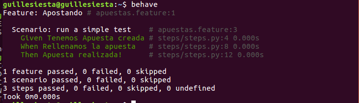

#### Ejercicio 4. Instalar alguno de los entornos virtuales de node.js (o de cualquier otro lenguaje con el que se esté familiarizado) y, con ellos, instalar la última versión existente, la versión minor más actual de la 4.x y lo mismo para la 0.11 o alguna impar (de desarrollo).

Al estar trabajando con python, he instalado el entorno virtual [virtualend](https://virtualenv.pypa.io/en/latest/). Me ha servido de muchísima ayuda este [tutorial](http://osl.ugr.es/2016/10/17/entornos-virtuales-en-python-con-virtualenv/) escrito por la maravillosa [oficina de software libre de la UGR](http://osl.ugr.es/).

Creados entornos virtuales para versiones 2.7 y 3.5

#### Ejercicio 5. Como ejercicio, algo ligeramente diferente: una web para calificar las empresas en las que hacen prácticas los alumnos. Las acciones serían: Crear empresa, Listar calificaciones para cada empresa, crear calificación y añadirla (comprobando que la persona no la haya añadido ya), borrar calificación (si se arrepiente o te denuncia la empresa o algo), Hacer un ránking de empresas por calificación, por ejemplo, Crear un repositorio en GitHub para la librería y crear un pequeño programa que use algunas de sus funcionalidades. Si se quiere hacer con cualquier otra aplicación, también es válido. Se trata de hacer una aplicación simple que se pueda hacer rápidamente con un generador de aplicaciones como los que incluyen diferentes marcos MVC. Si cuesta mucho trabajo, simplemente prepara una aplicación que puedas usar más adelante en el resto de los ejercicios.

De momento, al no disponer de demasiado tiempo, haré un [MVC cutre](https://github.com/guillesiesta/IV-17-18-Ejercicios/tree/master/code/MVC_Cutre) que contenga lo justo para poder continuar haciendo los ejercicios. Cuando disponga de más tiempo crearé el repositorio pertinente y lo enlazaré [aquí](*). Me basaré en el sistema de apuestas usado en anteriores ejercicios y no en el sistema para la gestión de empresas de las prácticas de los alumnos.

#### Ejercicio 6. Ejecutar el programa en diferentes versiones del lenguaje. ¿Funciona en todas ellas?

Primera ejecución realizada con el environment python 2.7

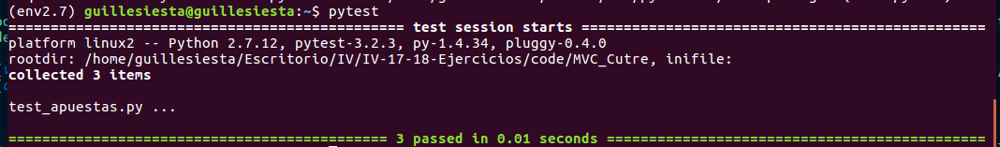

Segunda ejecución realizada con el environment python 3.5

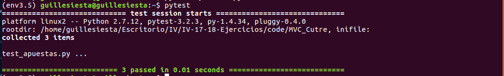

Funciona correctamente, aunque esto se preveía pues aún el proyecto no es demasiado grande y no hay muchas diferencias sintácticas en el código entre python 2.7 y la versión 3.5.

#### Ejercicio 7. Crear una descripción del módulo usando package.json. En caso de que se trate de otro lenguaje, usar el método correspondiente.

Al estar usando python, el siguiente comando nos dice lo mismo que package.json en javascript.

pip freeze > requirements.txt

Y para instalar las dependencias se ejecuta el siguiente comando

pip install -r requirements.txt

#### Ejercicio 8. Automatizar con grunt, gulp u otra herramienta de gestión de tareas en Node la generación de documentación de la librería que se cree usando docco u otro sistema similar de generación de documentación. Previamente, por supuesto, habrá que documentar tal librería.

#### Ejercicio 9. Haced los dos primeros pasos antes de pasar al tercero.

