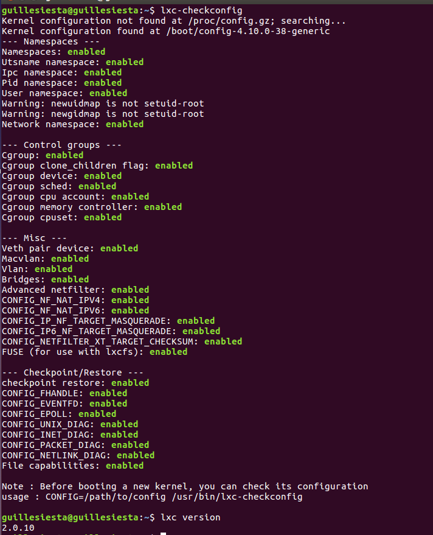

#### Ejercicio 1. Instala LXC en tu versión de Linux favorita. Normalmente la versión en desarrollo, disponible tanto en GitHub como en el sitio web está bastante más avanzada; para evitar problemas sobre todo con las herramientas que vamos a ver más adelante, conviene que te instales la última versión y si es posible una igual o mayor a la 1.0.

Instalo LXC versión 2.0.10 mediante este comando : sudo apt-get install lxc2 && lxc1

Comprobación de versión y configuración:

#### Ejercicio 2. Crear y ejecutar un contenedor basado en tu distribución y otro basado en otra distribución, tal como Fedora. Nota En general, crear un contenedor basado en tu distribución y otro basado en otra que no sea la tuya.

En ubuntu:

sudo lxc-create -t ubuntu -n una-caja
sudo lxc-create -t ubuntu-cloud -n nubecilla

#### Ejercicio 3. Instalar docker.

Me doy de alta en la web e instalo la versión para ubuntu. Siguiendo estos [pasos](https://docs.docker.com/engine/installation/linux/docker-ee/ubuntu/)

#### Ejercicio 4. 
##### Ejercicio 4.1. Instalar a partir de docker una imagen alternativa de Ubuntu y alguna adicional, por ejemplo de CentOS.

Instalo [Ubuntu DebootStrap](https://hub.docker.com/_/ubuntu-debootstrap/) y [CentOS](https://hub.docker.com/_/centos/)

##### Ejercicio 4.2. Buscar e instalar una imagen que incluya MongoDB.

## TODOS LOS EJERCICIOS SIGUIENTES ESTAN REALIZADOS EN MI PROYECTO PERSONAL [PROJECT X](https://github.com/guillesiesta/ProjectX)

#### Ejercicio 5. Crear un usuario propio e instalar alguna aplicación tal como nginx en el contenedor creado de esta forma, usando las órdenes propias del sistema operativo con el que se haya inicializado el contenedor.
#### Ejercicio 6. Crear a partir del contenedor anterior una imagen persistente con commit.
#### Ejercicio 7. Crear un Dockerfile para el servicio web que se ha venido desarrollando en el proyecto de la asignatura.
#### Ejercicio 8. Desplegar un contenedor en alguno de estos servicios, de prueba gratuita o gratuitos.
