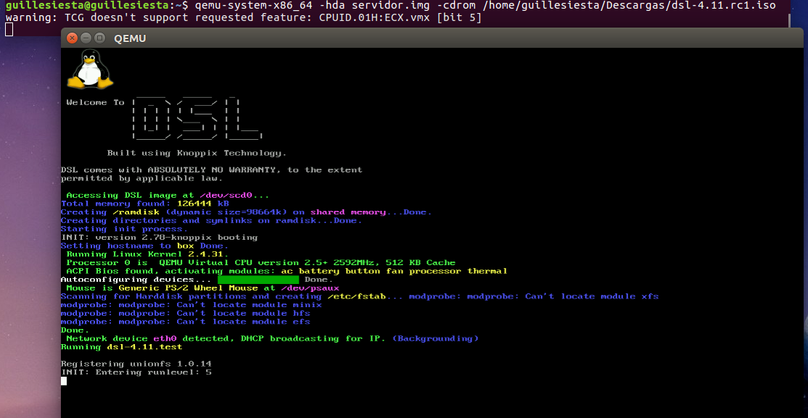

#### Ejercicio 1. Instalar los paquetes necesarios para usar KVM. Ya lo hicimos en el primer tema, pero volver a comprobar si nuestro sistema está preparado para ejecutarlo o hay que conformarse con la paravirtualización.

Comprobamos que funciona. 

#### Ejercicio 2. Crear varias máquinas virtuales con algún sistema operativo libre tal como Linux o BSD. Si se quieren distribuciones que ocupen poco espacio con el objetivo principalmente de hacer pruebas se puede usar CoreOS (que sirve como soporte para Docker) GALPon Minino, hecha en Galicia para el mundo, Damn Small Linux, SliTaz (que cabe en 35 megas) y ttylinux (basado en línea de órdenes solo).

Voy a instalar DSL, primero creo el disco duro con:

Con la imagen previamente descargada, ejecutamos el siguiente comando:

qemu-system-x86_64 -hda servidor.img -cdrom dsl-4.1.rc1.iso 

#### Ejercicio 3. Crear un benchmark de velocidad de entrada salida y comprobar la diferencia entre usar paravirtualización y arrancar la máquina virtual simplemente con qemu-system-x86_64 -hda /media/Backup/Isos/discovirtual.img

#### Ejercicio 4. Crear una máquina virtual Linux con 512 megas de RAM y entorno gráfico LXDE a la que se pueda acceder mediante VNC y ssh.

#### Ejercicio 5. Crear una máquina virtual ubuntu e instalar en ella alguno de los servicios que estamos usando en el proyecto de la asignatura.

Este ejercicio lo voy a realizar en mi [proyecto personal](https://github.com/guillesiesta/ProjectX) 

#### Ejercicio 6. Instalar una máquina virtual con Linux Mint para el hipervisor que tengas instalado.

Ejecuto el siguiente comando para crear el disco duro:

qemu-img create -f qcow2 linuxmint.img 8G

